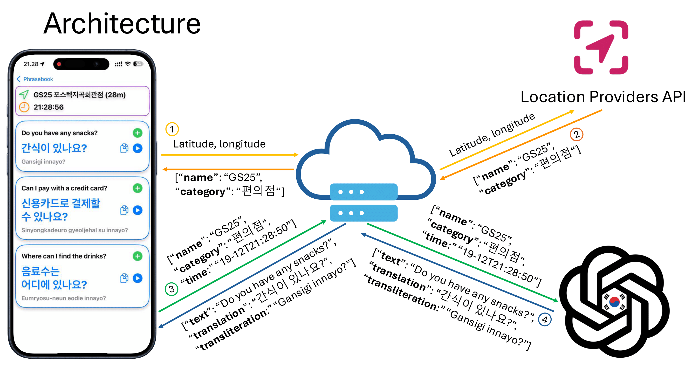

# Phraser
<p align="center">
   
</p>
Phraser is an app designed to help users quickly access and save translated phrases in various languages based on customizable categories. The app's main functionality includes displaying, translating, and organizing phrases into folders for quick retrieval. Additionally, the app has a context-aware assistant, which provides relevant phrases based on factors such as time of day or location.

## Features

- **Customizable Categories**: Users can create and organize phrases into their own categories, each displayed as a navigable folder.
- **Phrase Translation**: New phrases entered by the user are instantly translated into a target language.
- **Phonetic Support**: Along with translations, phonetic representations are provided to assist with pronunciation.
- **Audio Playback**: Translated phrases can be played aloud to help with pronunciation and language learning.
- **Context-Aware Suggestions**: The app suggests phrases based on context (e.g., time of day), which users can add to their own categories.
- **User-Friendly Interface**: Makes use of SwiftUI for an efficient and clean category display, alongside a streamlined phrase entry and display interface.

## Video Demo


https://github.com/user-attachments/assets/89f8e3f6-241a-4be9-b109-005f2e407d55


## Screenshots

|                        Category view                         |                      Adding a category                       |
| :----------------------------------------------------------: | :----------------------------------------------------------: |
|                 |       |
|                     **Phrase overview**                      |                    **Creating a phrase**                     |
|                       |          |
|                   **Context-Aware Phrase**                   |       **Searching for Phrases (English translation)**        |
|  |  |
|       **Searching for Phrases (Translated language)**        |         **Searching for Phrases (Transliteration)**          |
|  |  |
|                 **Selecting a new language**                 |                 **Selecting a new language**                 |
|  |  |
|          **New categories for Chinese phrasebook**           |              **Phrase translations in Chinese**              |
|     |         |

| Context-Aware Phrases, side by side          |
| -------------------------------------------- |
|       |
| **Basic architectural overview**             |
|  |

## Usage

1. **Add New Category**: From the main screen, tap the "Add Category" button to create a new category.
2. **Create Phrases**: Enter a phrase, and it will be automatically translated with phonetic and audio support.
3. **Organize Phrases**: Add phrases to your preferred categories for easy access.
4. **Contextual Phrases**: Access the "Context-Aware Phrases" section for suggestions based on your current context.

## Technology Stack

- **SwiftUI**: Provides a responsive and adaptive UI for seamless interaction.
- **SwiftData**: Manages persistent data storage for phrases and categories.
- **Azure Translation API**: Handles real-time translation of user-entered phrases.
- **AVFoundation**: Plays back translated phrases to support language learning.

## Getting Started

### Prerequisites

- Xcode 14 or later
- iOS 18.1 or later for the target device

### Installation

1. Clone the repository:

   ```bash
   git clone https://github.com/JonasKaad/Phraser.git
   ```

2. Open `Phraser.xcodeproj` in Xcode.

3. Setup the credentials in `Secrets.xcconfig`

4. Build and run the project on an iOS simulator or a physical device.

## Author
* [Jonas Solhaug Kaad](https://github.com/JonasKaad)

## License

This project is licensed under the Apache-2.0 License - see the `LICENSE` file for details.
